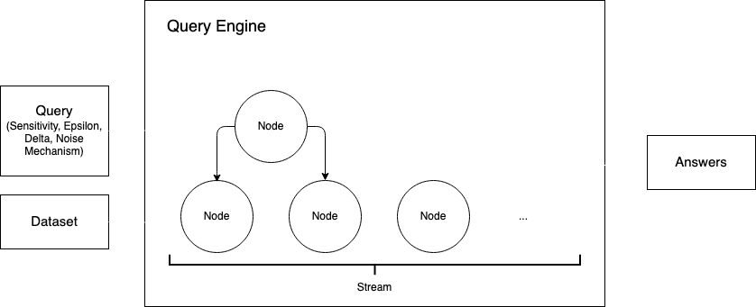

# Differential Privacy for Streaming Data

## Problem Statement
- Given a streaming database and a set of queries, we want to periodically release answers privately on this database.
- The streaming database is updated over time. In each update, the following operations are possible: insert a new record, delete an existing record, no operation.
- Operations are batched per day, i.e., we will release answers at the end of each day.

## Design



### Query 

A query object encapsulates the desired privacy parameters, sensitivity, and the noise mechanism being used to compute a function over the dataset.

The following queries are currently supported:
1. Count Query: Return the number of records in the dataset.
1. Predicate Query: Return the number of records in the dataset that satisfy the specified predicate (e.g., number of people who are 25 years old).
1. PMW Query: Estimate the synthetic data distribution that is 'trained' using the set of queries and return answers for each query in this set. Uses the MWEM algorithm to learn the synthetic data distribution.
1. MST Query: Estimate the synthetic data distribution that is 'trained' using the set of queries and return answers for each query in this set. Uses the MST algorithm from the `private-pgm` package to learn the synthetic data distribution.
1. MWEM-PGM Query: Estimate the synthetic data distribution that is 'trained' using the set of queries and return answers for each query in this set. Uses the MWEM-PGM algorithm from the `private-pgm` package to learn the synthetic data distribution.

You can define your own queries by extending the base `Query` class. Your class should contain the following methods:
1. `set_privacy_parameters()`: Update the privacy parameters (epsilon, delta) for the query. This is useful when you want to change the privacy parameters specified during query initialization. 
2. `get_true_answer()`: Return the answer of the query on the dataset, without noise added.
3. `get_private_answer()`: Return the answer of the query on the dataset, after noise has been added using a desired private mechanism (e.g., Laplace). 

#### Implementation Notes

The MST algorithm needs more than a few datapoints to estimate the synthetic data distribution, but the Binary Restarts Mechanism updates the deletion streams one deletion at a time. This might cause numerical instability errors while sampling data from the learnt synthetic data distribution. 
To fix these errors, add the following lines after `mbi/graphical_model.py#L212` in the `private-pgm` package:
```python
def synthetic_col(counts, total):  # L212
    counts = np.nan_to_num(counts)  # ADD THIS LINE
    counts[counts == 0] = 1e-32  # ADD THIS LINE
```

### Dataset

A compatible dataset should have the following columns:
1. ID: This column contains a unique identifier for each record.
1. Insertion Time: This column contains the timestamp of when the record was inserted into the dataset. 
1. Deletion Time: This column contains the timestamp of when the record was removed from the dataset. 

Datasets currently supported: Adult Income, ACS datasets provided by the [`folktables`](https://github.com/socialfoundations/folktables/tree/main) Python package, and randomly generated toy datasets. See `data/preprocessor.py` for more details.

### Query Engine

The query engine encapsulates how the dataset is processed as a stream. A query engine takes a Query and a Dataset as input, and returns answers according to the desired time interval (e.g., release answers each day). Each query engine defines a tree representation for the stream. This representation is in turn determined by the type of node used by the tree.   

The following query engines are currently supported: 
1. Naive Binary: Two binary streams made of NaiveNodes. One stream processes insertions and the other processes deletions.
1. Binary Restarts: A single binary stream made of RestartNodes. Each node consists of insertions and its own deletion stream to track if any of its items have been deleted. 

#### Nodes

A node is a unit of the tree that represents the dataset stream. 

The following nodes are currently supported: 
1. NaiveNode: A simple node that computes the query on the IDs added to the node on initialization.
1. RestartNode: A node that tracks how many IDs added to the node on initialization are deleted, and refreshes the node once there are enough deletions.

## Demo


## Credits

1. https://github.com/mrtzh/PrivateMultiplicativeWeights.jl
2. https://github.com/ryan112358/private-pgm